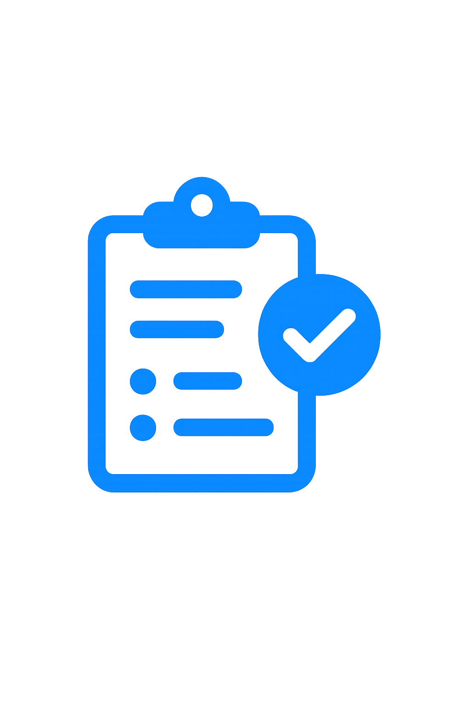

<!-- Improved compatibility of back to top link: See: https://github.com/othneildrew/Best-README-Template/pull/73 -->
<a id="readme-top"></a>
<!--
*** Thanks for checking out the Best-README-Template. If you have a suggestion
*** that would make this better, please fork the repo and create a pull request
*** or simply open an issue with the tag "enhancement".
*** Don't forget to give the project a star!
*** Thanks again! Now go create something AMAZING! :D
-->


<!-- PROJECT SHIELDS -->
<!--
*** I'm using markdown "reference style" links for readability.
*** Reference links are enclosed in brackets [ ] instead of parentheses ( ).
*** See the bottom of this document for the declaration of the reference variables
*** for contributors-url, forks-url, etc. This is an optional, concise syntax you may use.
*** https://www.markdownguide.org/basic-syntax/#reference-style-links
-->
[![Contributors][contributors-shield]][contributors-url]
[![Forks][forks-shield]][forks-url]
[![Stargazers][stars-shield]][stars-url]
[![Issues][issues-shield]][issues-url]
[![project_license][license-shield]][license-url]
[![LinkedIn][linkedin-shield]][linkedin-url]


<!-- PROJECT LOGO -->
<br />
<div align="center">
  <a href="https://github.com/kende2003/taskflow-devops-demo">
    
  </a>

<h3 align="center">TaskFlow-Demo</h3>

  <p align="center">
    Cloud-native task management demo with Express, React, K8s, and Terraform on AWS.
    <br />
    <a href="https://github.com/kende2003/taskflow-devops-demo"><strong>Explore the docs »</strong></a>
    <br />
    <br />
    <a href="https://github.com/kende2003/taskflow-devops-demo">View Demo</a>
    &middot;
    <a href="https://github.com/kende2003/taskflow-devops-demo/issues/new?template=bug-report.md">Report Bug</a>
    &middot;
    <a href="https://github.com/kende2003/taskflow-devops-demo/issues/new?template=feature-request.md">Request Feature</a>
  </p>
</div>


<!-- TABLE OF CONTENTS -->
<details>
  <summary>Table of Contents</summary>
  <ol>
    <li>
      <a href="#about-the-project">About The Project</a>
      <ul>
        <li><a href="#built-with">Built With</a></li>
      </ul>
    </li>
    <li>
      <a href="#getting-started">Getting Started</a>
      <ul>
        <li><a href="#prerequisites">Prerequisites</a></li>
        <li><a href="#installation">Installation</a></li>
      </ul>
    </li>
    <li><a href="#usage">Usage</a></li>
    <li><a href="#license">License</a></li>
    <li><a href="#contact">Contact</a></li>
    <li><a href="#acknowledgments">Acknowledgments</a></li>
  </ol>
</details>


<!-- ABOUT THE PROJECT -->
## About The Project
[![Product Screenshot][product-screenshot]](https://example.com)  
*Note: Screenshot is a placeholder for the upcoming UI.*

This is a demo project inspired by the mobile app Task Flow, designed to showcase task‑management workflows.
It demonstrates:

- Microservices architecture (Auth, Todos, Notifications)
- Cloud deployment with AWS EKS
- Infrastructure as Code using Terraform
- Pod Identity / IRSA for secure AWS service access per microservice

⚠️ **Note:** This project is currently under development; not all features are implemented yet.

<p align="right">(<a href="#readme-top">back to top</a>)</p>

### Built With

* [![React][React.js]][React-url]
* [![Express][Express.js]][Express-url]
* [![Terraform][Terraform.io]][Terraform-url]
* [![PostgreSQL][PostgreSQL.org]][PostgreSQL-url]
* [![JavaScript][JavaScript.com]][JavaScript-url]
* [![AWS][AWS.io]][AWS-url]


<p align="right">(<a href="#readme-top">back to top</a>)</p>


<!-- GETTING STARTED -->
## Getting Started

To set up the application locally do the following steps.

## Prerequisites

Before starting, ensure you have:

- AWS Account with permissions to create resources (EKS, RDS, IAM, etc.)
- AWS CLI installed
- Terraform installed (for infrastructure provisioning)
- Nodejs & npm installed

### Installation

1. Clone the repository
```bash
git clone https://github.com/kende2003/taskflow-devops-demo
cd taskflow-devops-demo
```
2. Configure AWS credentials:
```bash
aws configure
```
3. Build Docker images for all microservices:
``` bash
docker build -t taskflow-auth ./backend/auth
```

4. Deploy infrastructure and Kubernetes resources with Terraform:
``` bash
cd terraform
terraform init
terraform apply
```
✅ Terraform will automatically create the EKS cluster, namespaces, deployments, services, ingresses, ConfigMaps, Secrets, etc.
✅ Microservices use Pod Identity (IRSA) for AWS permissions.

<p align="right">(<a href="#readme-top">back to top</a>)</p>


<!-- USAGE EXAMPLES -->
## Usage

Accessing the API
- The auth API will be available at http://localhost:8080/api/v1/auth

- Example endpoints:
    - POST /register
    - POST /login
    - POST /logout
    - GET /authenticate

- Example to register a user:
``` bash
curl -X POST http://localhost:8080/api/v1/auth/register \
  -H "Content-Type: application/json" \
  -d '{"username": "testuser", "password": "123456"}'
```
<p align="right">(<a href="#readme-top">back to top</a>)</p>


<!-- ROADMAP -->
## Roadmap

This project is currently under active development. Below is the planned roadmap for future features:

### Backend & Microservices
- [x] Finish Auth microservice
- [ ] Build Todos microservice
- [ ] Integrate Notifications microservice
- [ ] Setup API Gateway for routing
- [x] Implement RBAC (Role-Based Access Control)
- [x] CloudWatch monitoring
- [ ] Collect DB metrics with Prometheus
- [ ] Add unit and integration tests

### Frontend / UI
- [ ] Design and implement TaskFlow UI
- [ ] Add authentication and registration forms
- [ ] Task CRUD operations
- [ ] Implement Kanban-style task board
- [ ] Responsive design for mobile and desktop


### Infrastructure & DevOps
- [ ] Automate CI/CD pipelines
- [ ] Containerize all microservices with Docker
- [ ] Deploy full stack on AWS EKS
- [ ] Configure Terraform for infrastructure management
- [x] Setup secrets management and environment variables

### Future Features
- [ ] Notifications (email & push)
- [ ] Task comments and attachments
- [ ] Recurring tasks and reminders
- [ ] Analytics and reporting dashboard
- [ ] User roles with different permissions

See the [open issues](https://github.com/kende2003/taskflow-devops-demo/issues) for a detailed list of proposed features and known issues.

<p align="right">(<a href="#readme-top">back to top</a>)</p>

<!-- LICENSE -->
## License

This project is licensed under the MIT License - see the [LICENSE](LICENSE.txt) file for details.
<p align="right">(<a href="#readme-top">back to top</a>)</p>

<!-- CONTACT -->
## Contact

Kende Fay - [LinkedIn](https://www.linkedin.com/in/kende-fay/)

Project Link: [https://github.com/kende2003/taskflow-devops-demo](https://github.com/kende2003/taskflow-devops-demo)


<p align="right">(<a href="#readme-top">back to top</a>)</p>


<!-- ACKNOWLEDGMENTS -->
## Acknowledgments

A big thanks to the following resources and tools that helped in this project:

* [Best README Template](https://github.com/othneildrew/Best-README-Template)
* [Shields.io](https://shields.io/)
* [Docker](https://www.docker.com/)
* [Kubernetes](https://kubernetes.io/)


<p align="right">(<a href="#readme-top">back to top</a>)</p>


<!-- MARKDOWN LINKS & IMAGES -->
<!-- https://www.markdownguide.org/basic-syntax/#reference-style-links -->
[contributors-shield]: https://img.shields.io/github/contributors/kende2003/taskflow-devops-demo.svg?style=for-the-badge
[contributors-url]: https://github.com/kende2003/taskflow-devops-demo/graphs/contributors
[forks-shield]: https://img.shields.io/github/forks/kende2003/taskflow-devops-demo.svg?style=for-the-badge
[forks-url]: https://github.com/kende2003/taskflow-devops-demo/network/members
[stars-shield]: https://img.shields.io/github/stars/kende2003/taskflow-devops-demo.svg?style=for-the-badge
[stars-url]: https://github.com/kende2003/taskflow-devops-demo/stargazers
[issues-shield]: https://img.shields.io/github/issues/kende2003/taskflow-devops-demo.svg?style=for-the-badge
[issues-url]: https://github.com/kende2003/taskflow-devops-demo/issues
[license-shield]: https://img.shields.io/github/license/kende2003/taskflow-devops-demo.svg?style=for-the-badge
[license-url]: https://github.com/kende2003/taskflow-devops-demo/blob/master/LICENSE.txt
[linkedin-shield]: https://img.shields.io/badge/-LinkedIn-black.svg?style=for-the-badge&logo=linkedin&colorB=555
[linkedin-url]: https://www.linkedin.com/in/kende-fay/
[product-screenshot]: images/screenshot.png

<!-- Shields.io badges. You can a comprehensive list with many more badges at: https://github.com/inttter/md-badges -->
[React.js]: https://img.shields.io/badge/React-20232A?style=for-the-badge&logo=react&logoColor=61DAFB
[React-url]: https://reactjs.org/

[Terraform.io]: https://img.shields.io/badge/Terraform-623CE4?style=for-the-badge&logo=terraform&logoColor=white
[Terraform-url]: https://www.terraform.io/

[PostgreSQL.org]: https://img.shields.io/badge/PostgreSQL-316192?style=for-the-badge&logo=postgresql&logoColor=white
[PostgreSQL-url]: https://www.postgresql.org/

[JavaScript.com]: https://img.shields.io/badge/JavaScript-F7DF1E?style=for-the-badge&logo=javascript&logoColor=black
[JavaScript-url]: https://developer.mozilla.org/en-US/docs/Web/JavaScript

[Express.js]: https://img.shields.io/badge/Express-000000?style=for-the-badge&logo=express&logoColor=white
[Express-url]: https://expressjs.com/

[AWS.io]: https://img.shields.io/badge/AWS-232F3E?style=for-the-badge&logo=amazon-aws&logoColor=white
[AWS-url]: https://aws.amazon.com/

